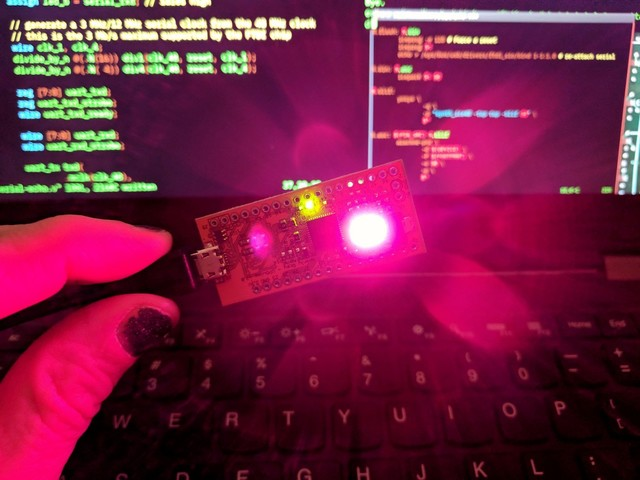
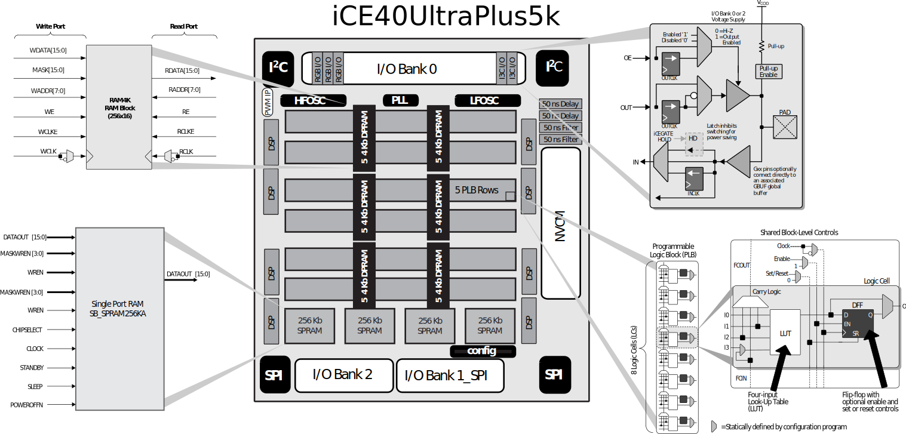

Based on Trammell Hudson's demos, with the addition of support for programming SRAM, by tunning:

  sudo make [file].sram

instead of:

  sudo make [file].flash

R3 and R4 both need to be removed and rotated 90°, using the same four pads, to allow SRAM programming.  It is possible to fit a 2x2 2 mm square-pin SMT header on the pads, and rotate two shunts, between the two positions, to select SRAM or flash programming.

====

Upduino v2 examples with icestorm
====

Several demos showing how to use the `icestorm` toolchain with the
Upduino (ice40 UltraPlus 5k) FPGA dev board.

| Demo | Description |
|------|-------------|
| `blink` | Flash the RED LED in a pulse-pulse, pulse-pulse pattern |
| `pulse` | Smoothly ramp the RGB LED through a color change pattern |
| `serial` | Print a repeating message on the serial port at 3 Mbs |
| `seral-echo` | Read from the serial port, echo it back at 3 Mbs |
| `spram-demo` | Read from the serial port, buffer in SPRAM, echo it slowly |

To flash them, run `sudo make blink.flash`.
You will probably need to be root to flash the board and restore the
`/dev/ttyUSB0` device driver after `iceprog` switches it into SIO mode.

Schematics and pinout
====

Schematics for the upduino: https://github.com/gtjennings1/UPDuino_v2_0

Note that the `upduino_v2.pcf` file disagrees with the serial port in
the pinout and schematic.  The pins were determined through experimentation
and seem to work (and the ones in the pinout do not).

UltraPlus 5K overview
===

Overview: http://www.latticesemi.com/Products/FPGAandCPLD/iCE40UltraPlus

Datasheet: http://www.latticesemi.com/-/media/LatticeSemi/Documents/DataSheets/iCE/iCE40-UltraPlus-Family-Data-Sheet.ashx
